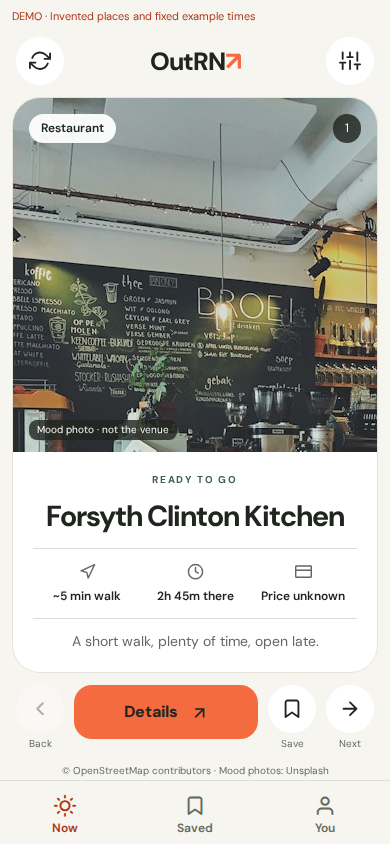
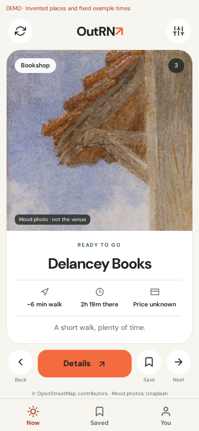
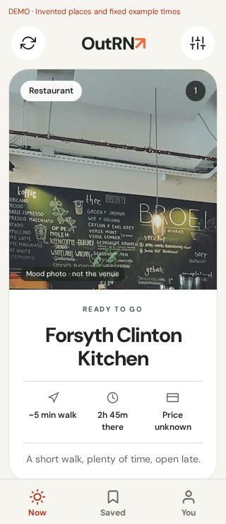

# Activity-first discovery

The activity owns the screen. The previous home spent too much space on greetings, filter chips,
and a left-aligned shortlist. This revision replaces that hierarchy with one large activity profile.

## Layout and interaction

- Compact, symmetrical header: refresh or current outing, OutRN wordmark, filter control.
- Full-width hero, centered activity name, and a balanced row of travel, useful time, and price.
- One recommendation at a time, preserving the server's order. Swipe left for next, right for
  previous, or use the labeled buttons. Swipes do not create a dislike or change ranking.
- Explicit Details and Save actions. Saving stays separate from browsing.
- Filters open on demand; changing the area remains available under You.
- Required caveats, age restrictions, source attribution, insufficient supply, cursor expiry,
  offline recovery, and storage errors remain visible when relevant.
- Vertical scrolling handles long names, warnings, larger text, and short displays. At 320 × 740,
  the action row may require scrolling; content is not clipped to force a fixed-height card.

The visual references are [Hinge Discover](https://help.hinge.co/hc/en-us/articles/36311592824595-Discover-Feed)
and [Tinder's 2026 discovery presentation](https://www.tinderpressroom.com/2026-03-12-Tinder-Debuts-Inaugural-Product-Keynote-Tinder-Sparks-2026-Start-Something-New):
a focused visual profile, nearby actions, and secondary preferences outside the primary surface.
The warm paper palette, orange actions, and typography continue OutRN's existing direction.

## Photography boundary

The current contract has no venue image field. Demo mode uses two bundled category mood photos
with a visible “Mood photo · not the venue” label. Production uses decorative category artwork
and explicitly says when a venue photo is unavailable. Photos are never presented as evidence
about an actual place. Sources and license are in [the asset notes](../assets/photos/README.md).

## Screenshots

| First activity · 390 × 844 | Culture activity · 390 × 844 | Small display · 320 × 740 |
| --- | --- | --- |
|  |  |  |

## Verification

Browser interaction checks against the actual mock API cover single-card display, hidden filters,
first-card Back disabled, next/previous, horizontal swiping without accidental detail navigation,
cursor-boundary Back, detail navigation, saved persistence, filter payloads, 320px overflow,
finite endings, low/zero supply, cursor expiry, and offline retry. No browser errors occurred.

Mobile typecheck, lint, workspace boundary check, and iOS/Android/web JavaScript exports passed.
A separate production-mode browser check confirmed the artwork fallback, absence of demo photos,
and every caveat, required reason, and age restriction in the family fixtures. Native gesture behavior, VoiceOver/TalkBack, and device text scaling
still need device QA before release; browser checks and bundles do not replace that review.
