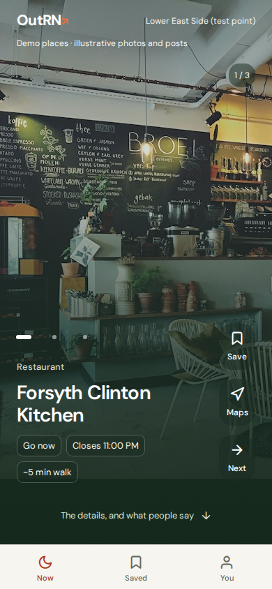
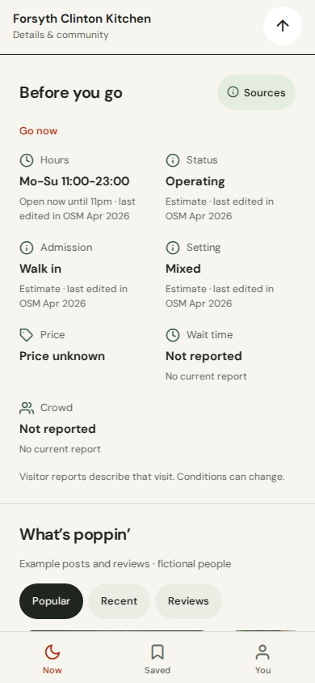
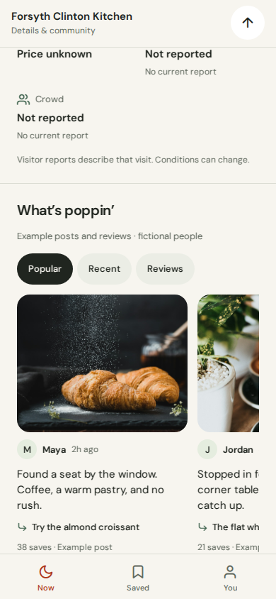

# Approved OutRN mobile direction

This implements the Social discovery prototype approved on September 28, including its final typography pass. It replaces the screen designs in PRs #5 and #6. The new branch starts from main including engine PR #7 and carries forward their API client, local saves, navigation, error states and workspace boundary checks.

| Discovery | Before you go | Community |
| --- | --- | --- |
|  |  |  |

## Interaction and typography

The activity fills the arrival screen. The photograph/category artwork meets one Now / Saved / You tab bar with no details panel peeking through. Save, Maps and Next sit in the right rail. Horizontal swipes and photo buttons change the image of the same activity. Next changes the activity. Scrolling reveals Before you go, What’s poppin’, Getting there and Your plan. Preferences are under You and at the end of the activity.

DM Sans stays the app font. Activity titles are 28/32, section headings 20/26, body text 15/22, labels 13/19 and secondary text 12/18 (font size/line height). Navigation labels are 11. Reading text scales with system text settings; fact cards stack above 115% font scale and the hero can grow beyond one screen when needed. Rail labels cap at 140% to preserve their small controls. All primary controls retain at least 44-point targets. Native screen reader, large-text and gesture QA remains required.

The Now icon switches between sun and moon using the device's local time. Weather has no data source yet, so it is not simulated in the live app.

## Data boundaries

Mobile consumes only `@outrn/contracts` over the v1 HTTP API. It does not recompute feasibility or ranking. All caveats, required reasons, age limits and booking cues remain visible. Unknown and estimated values remain qualified. The UI never presents the engine's usefulMinutes or finishBy as an assigned visit duration. Explicit event times, venue hours and a user-provided return deadline still matter.

| Available now | Deliberately unavailable in live mode |
| --- | --- |
| Server-ordered activities, hours, admission, price, age limits, provenance, estimated travel, directions, local saves | Venue photo feeds, community posts/reviews, wait times, crowds, live road traffic, parking availability |

The current mock does not compute new travel estimates when selecting a different mode. Getting there shows the server estimate only for the mode it belongs to; other modes say Check in Maps and use the corresponding directions URL. The origin label respects contract 1.1's originIsDefault.

The demo illustrates community posts and a photo carousel only for matching cafe/restaurant/bakery or gallery/museum categories. Unmatched categories use artwork. Every example is labeled. There are no invented live reviews, crowd ratings or parking assurances. Demo Maps explains the intended handoff instead of routing to an invented venue.

The live layout uses category artwork and explicit unavailable states until the backend adds those capabilities through a jointly reviewed contract PR. Adding those feeds is separate from this UI change.

## Review feedback carried forward

| Source | Resolution here |
| --- | --- |
| #5 release HTTP API / missing configuration | Parsed URL validation requires an explicit HTTPS endpoint in release builds. Explicit localhost/127.0.0.1/[::1] previews are allowed; other HTTP endpoints, deceptive authorities, embedded credentials, query strings and malformed URLs are rejected. Development retains LAN support. |
| #5 template LICENSE | Removed the app-level LICENSE and retained the template attribution under a clearly scoped THIRD_PARTY_NOTICES.md. DM Sans OFL stays. |
| #5 and #6 missing booking cue | Book first takes precedence over a ready status on the hero and retained cards; required checks remain visible. Maps shows admission guidance before handoff for booking/check-first activities. |
| #6 demo photos in production | The entire demo module is behind an inline build-time environment check. Exports clear the Metro cache when switching modes. A SHA-256 asset gate checks the actual emitted files after export, and CI repeats the production gate. |
| #6 misleading restart | Find fresh options re-runs the original search, creating a new first-page snapshot. Previous activity still traverses server cursors. |
| #6 irrelevant demo photography | Only explicitly matched food and culture categories use mood photos. Parks, bars and other unmatched categories use category artwork. |

## Validation

Mobile and workspace type checks, mobile lint, workspace boundaries and frozen-lockfile installation pass. Unit tests: 296 passed; 40 database tests skipped locally and remain required in the database CI job. iOS, Android and web JavaScript exports pass in production and demo modes. The production export contains zero demo photos; the demo export contains all four, verified by file hashes.

Browser interaction results are in [approved/checks.json](approved/checks.json). Screenshots include [Sources](approved/sources.png), [320px](approved/small.png) and [production fallback](approved/production.png). These are Expo web captures, not native-device screenshots. Native maps/call handoff, VoiceOver/TalkBack, real gestures, system text scaling, app signing and store distribution remain unverified.

Neither prior PR needs to merge first. Review and merge the replacement against main after CI and product review.
