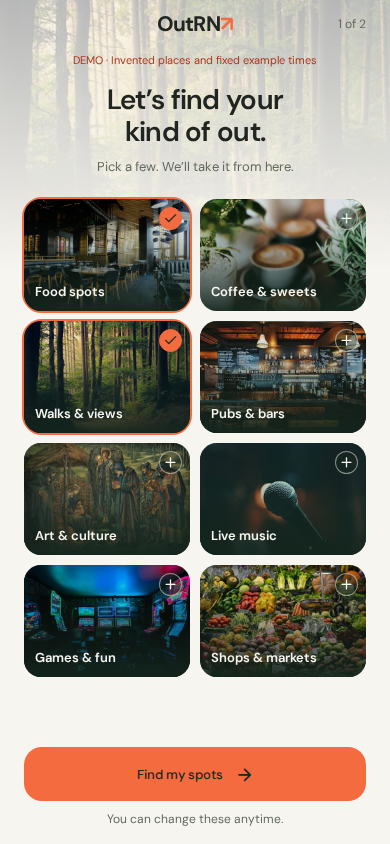
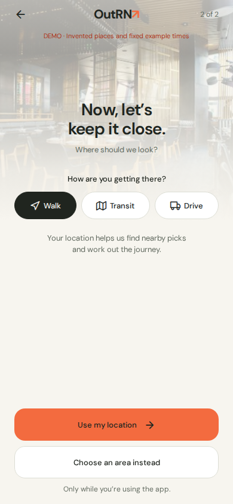
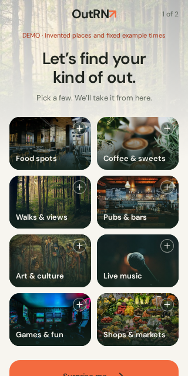

# First-run onboarding

Implements the approved continuous-background storyboard in the Expo app, using its existing
DM Sans, warm paper, coral, sage and green theme. The eight photo tiles are the main interaction;
the introduction fades into them without a separate photo strip. Copy stays brief, choices are
optional, and one primary action advances each step.

| Screen | Behavior |
| --- | --- |
| “Let’s find your kind of out.” | Toggle any interests. “Find my spots” continues; “Surprise me” continues with no taste weights. |
| “Now, let’s keep it close.” | Pick an API-offered travel mode; use foreground location or choose a supported area. |
| Manual area | Search actual API areas. Denial, disabled services, timeout and rejected coverage lead here. Travel starts from the area center. |
| First activity | Existing recommendation loading, result, error and empty states. The first result has a brief welcome line; no invented recommendation is inserted. |
| You → What you like | Edit the original choices and the remaining API-offered interests. Saving refreshes recommendations. |

## Data and handoff

`GET /v1/areas` supplies all request IDs, supported areas, travel modes, default time window and
maximum taste count. The first run groups offered IDs into eight short choices; unavailable IDs
are omitted. The editor also renders future/other interests using the server label.

- Food → `food`; coffee → `cafes`; walks → `outdoors`; pubs → `drinks`;
  art → `art` + `museums`; music → `live_music`; games → `games`; markets → `markets`.
- Each explicit pick contributes a soft `taste` weight of `0.8`. Deselecting removes it; unpicked
  interests stay unknown. These choices never become hard category filters.
- Every fresh recommendation request uses current, API-offered taste weights. Cursor requests
  remain cursor-only, preserving the backend's frozen paging snapshot.
- Device entry chooses the nearest advertised area center to ask the API, then sends `origin`.
  The backend alone validates coverage, eligibility and ranking. An `origin` field error returns
  to manual entry. The client does not invent coverage boundaries.
- Switching to a manual area clears any old device origin. Resetting activity filters retains
  the chosen origin and travel mode.

No engine, API, contract or web-app change is included. This is compatible with main's v1.8 contract.
The mock verifies request transport and rendering, but does not rank results by taste.

## Persistence and recovery

| Key | Stored data |
| --- | --- |
| `outrn.taste.v1` | `{ asked, weights }`, compatible with the existing taste proposal in PR #41. No learning/feedback service is added. |
| `outrn.onboarding.v1` | Version, current step, completion, area ID, travel mode and `device`/`area` source. No coordinates. |

Storage is validated on load and writes are serialized. Unfinished setup resumes at its saved step;
completed setup skips the wizard. A failed recommendation can retry without repeating setup or
losing interests. Existing saved places remain intact. Storage failures are visible and the session
can continue. A profile from the earlier taste picker starts at the nearby step.

Location permission is requested only after “Use my location”. Returning users with a device source
reuse an existing grant without prompting; denial or an unavailable fix returns to setup. A fix has
a 12-second deadline, paused while the explicit permission prompt is open. Back/manual navigation
aborts the attempt so late results cannot replace the user's choice. No background location, motion
permission, service or persisted coordinates are configured. Rebuild the native development app
after adding the Expo location module and permission configuration.

## Review and validation

Screenshots are of the running Expo web export at phone sizes with the explicit mock-data banner.
They show actual components rather than storyboard markup.

| Choose interests · 390 × 844 | Nearby · 390 × 844 | Small screen · 320 × 640 |
| --- | --- | --- |
|  |  |  |

Verified with Chromium against the existing mock API: first-run request gate, selection and
deselection, zero-choice entry, reload/resume, persisted completion and editable taste; foreground
geolocation, selected travel mode, denial/manual fallback, no saved coordinates, manual area clearing
the origin, backend coverage rejection, a late fix after manual selection, failed metadata retry,
failed recommendation retry, and no horizontal overflow at 320px. No browser runtime errors.

Unit tests cover corrupt storage, offered-interest mapping/limits, unknown versus disliked interests,
valid manual/device requests, origin validation errors, permission gating, disabled services,
cancellation, timeouts and malformed fixes. Mobile lint/typecheck, boundary checks, repository unit
tests and production iOS/Android/web exports are run for this change. The asset gate requires all
eight onboarding illustrations and still excludes all four demo venue photos from production.

Native-device permission dialogs, VoiceOver/TalkBack, system text scaling and keyboard/safe-area
behavior still need device QA before release. Larger system text switches the interest grid to a
single column; reduced-motion settings disable selection animation.

The result handoff intentionally uses main's current activity view. PR #18's API photo rendering
and compact navigation are separate work; reconcile the small `introduction` prop additions when
those changes land. PR #41's future taste-learning/editor implementation must retain the same
storage shape and the startup gate when integrating.
