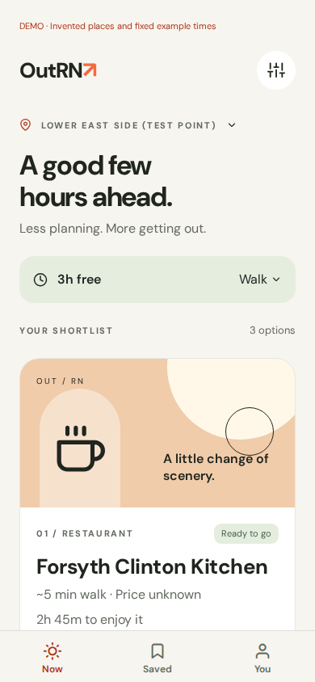
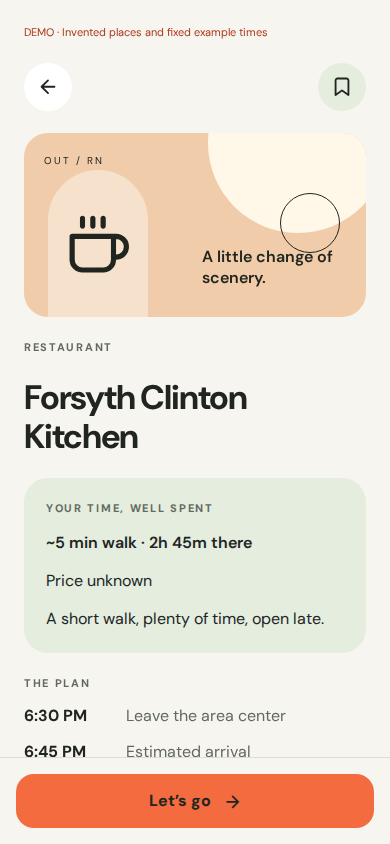
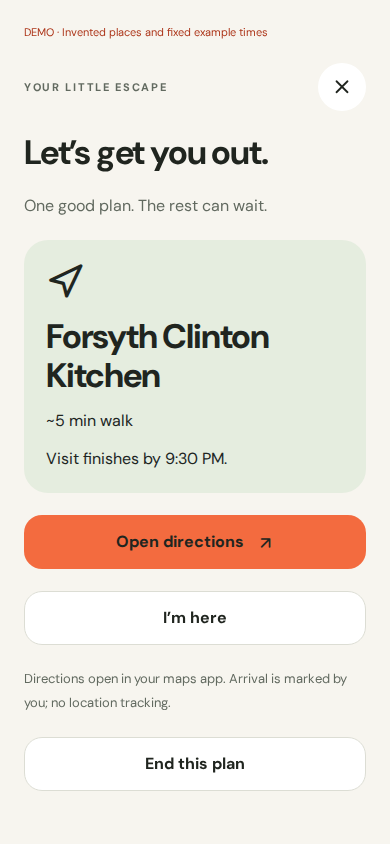
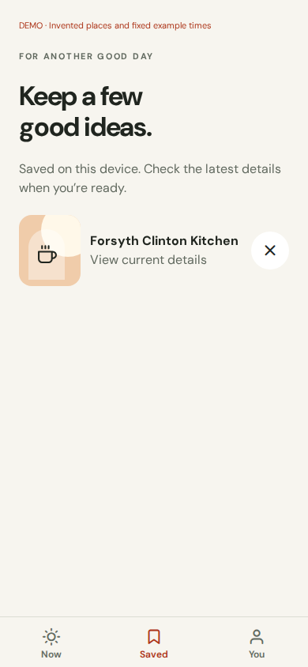
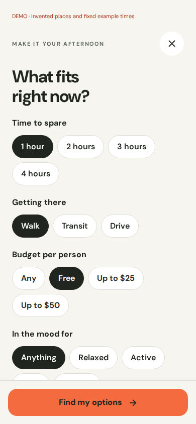
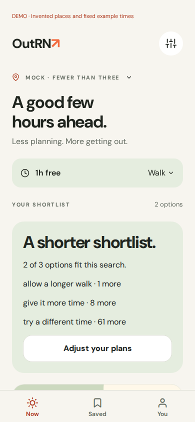

> Historical design from the superseded PR. The current implementation is documented in [APPROVED.md](APPROVED.md).

# Mobile implementation review

This is the first working Expo slice of the approved good-hours direction. The screenshots below
come from the exported web app at a 390 × 844 viewport, using the existing mock API handler and its
invented contract fixtures. They are implementation screenshots, not design renders.

| Now | Place details | Outing |
| --- | --- | --- |
|  |  |  |

| Saved | Filters | Low supply |
| --- | --- | --- |
|  |  |  |

Recovery screenshots: [empty](empty.png), [expired search](expired.png), [offline](offline.png),
and [320-pixel viewport](small-screen.png).

Validated locally:

- Mobile TypeScript and Expo lint.
- Root TypeScript and UI/backend import boundaries.
- 224 passing tests, including 11 mobile API/presentation tests. 21 database tests skipped without
  PostgreSQL; they remain covered by the repository's database CI job.
- JavaScript exports for iOS, Android, and web. This is not a signed native build or a device test.
- Chromium interaction check of the production web export against the real mock API handler:
  discovery → details → save → start outing → arrival → finish; persisted save after reload;
  filter request values; cursor paging; fewer than three; zero results; expired cursor/restart;
  failed network/retry; 320-pixel viewport. No browser runtime errors.
- Existing Next.js production build after disabling inherited declaration generation in its app
  TypeScript config. Mobile and web intentionally use the React versions required by their stacks.

Native device QA is still required for safe areas, font scaling, screen readers, keyboard behavior,
Android back navigation, maps/call handoff, and app lifecycle. App-store branding, signing, accounts,
reports, accurate venue photography, location-aware origins, and map comparison are separate slices.
