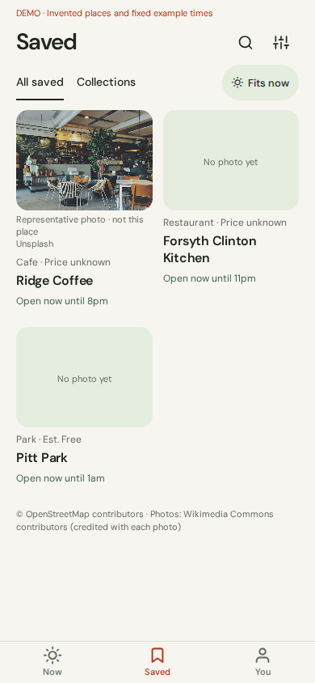
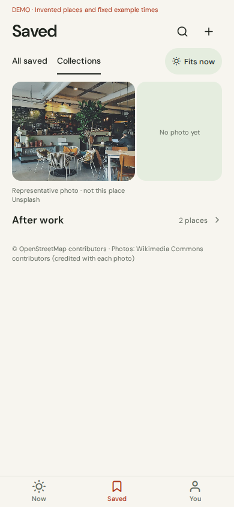
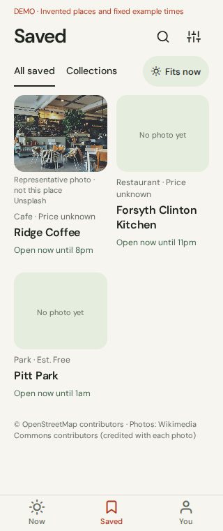

# Saved: photos and collections

Implements the October 4 approved storyboard. All changes are inside `apps/mobile`.

| All saved | Collections | 320 px |
| --- | --- | --- |
|  |  |  |

These are Expo web captures using the existing, explicitly labeled mock data. Native device testing remains necessary.

## Layout and interactions

- Default two-column photo grid; Collections provides grouped covers and an individual collection view.
- One compact row for All saved, Collections, and Fits now. No count subtitle or bookmark button on a saved card.
- Existing DM Sans, paper/sage/charcoal colors, coral navigation, and single Now / Saved / You bar.
- Search is revealed from the header; category and sort controls live in a sheet. All controls retain 44-point targets; larger system text can wrap controls and switch to a single-column grid.
- Create, rename, edit membership, and delete collections. Deleting a collection keeps its places in All saved.
- Long-press a place for collection membership or removal. The same menu is exposed as an accessibility action. Undo restores both the place's list position and collection memberships. Opening a place retains the existing detail-screen save control.
- Real venue photos use the existing contract field and show the complete linked photo credit. Saved shares the Now screen's vetted Wikimedia photo policy: try each venue photo, then labeled representative photos, then a neutral "No photo yet" state. Photo fallback never substitutes a category icon for a photograph. Production includes the existing representative assets and excludes invented demo posts.

## Data boundary

The UI imports only `@outrn/contracts` from the workspace and uses the existing HTTP client. No engine, API, contract, ingestion, database, ranking, or dependency changes are included.

Fits now starts a separate recommendation search with the current area, time allowance, travel, budget, and party settings. It omits an explicit planned `at` so this control checks now. It follows the API's frozen cursors and selects saved venue identities returned with `status: ready`. It never promotes check-first results, treats an event as its venue, or computes eligibility locally. The Now deck is not replaced. Booking cues, age limits, required notes, estimates, and source attribution remain visible. An absent result is described as unconfirmed for these plans, not proof that a place cannot be visited.

Results expire at the server's deadline. Failed, cancelled, changed, and incomplete page chains do not become successful empty searches. Offline saves remain available. Opening a matched place carries that response into the existing detail screen, which also enforces expiry and admission guidance.

Visible cards fetch place details with at most three requests in flight and a short session cache. Old hours are labeled for refresh; no travel time is invented for places without a current recommendation.

## Device storage

`outrn.saved.v2` stores place identities and collection membership together. When absent, the existing `outrn.saved.v1` identities are read. Migration writes only after a user change, and the older key stays intact. The new key is authoritative thereafter, including an intentionally empty library. Unreadable storage is surfaced with retry and is not overwritten. Writes are serialized and failures remain visible with retry. Photos, hours, and recommendation eligibility are not persisted.

The existing 200-place limit remains; collections are limited to 50. Removing or evicting a place cleans its collection references.

## Validation

- Mobile TypeScript, Expo lint, and UI/backend import boundary check.
- 38 mobile unit tests, including legacy migration, malformed storage, collection membership/Undo, paging, cancellation, ready/check-first/event distinctions, and the shared photo policy.
- Browser interaction checks: search, creation, editing, reload persistence, removal/Undo, Fits now, offline recovery, and single-row controls at 320 px.
- Production-browser checks: linked API photo credit, correct thumbnail scaling, labeled failed-image fallback, and expiry at the server deadline.
- iOS, Android, and web production exports; the upstream asset check confirms representative photos are included and invented demo content is excluded.

Native VoiceOver/TalkBack, keyboard behavior, large system text, and physical-device gestures have not been exercised in this environment.

The browser interaction record is in [saved/checks.json](saved/checks.json).
